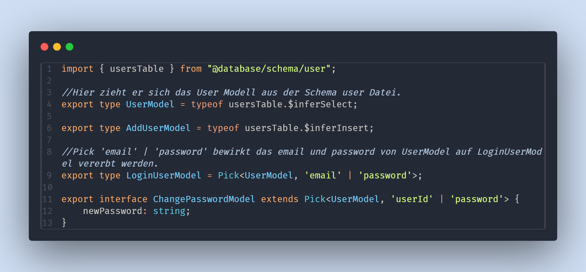
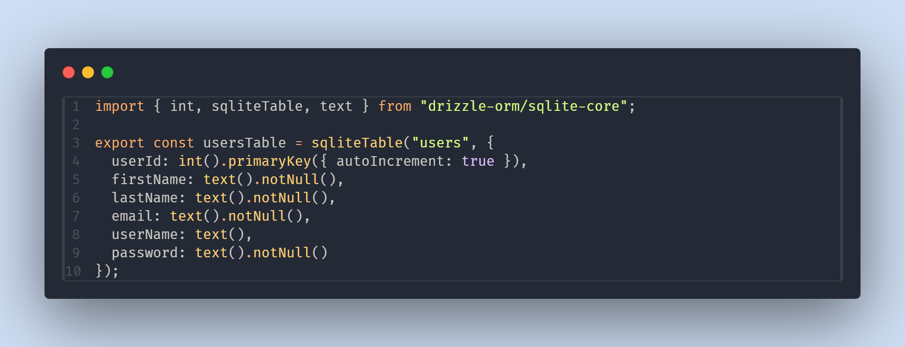
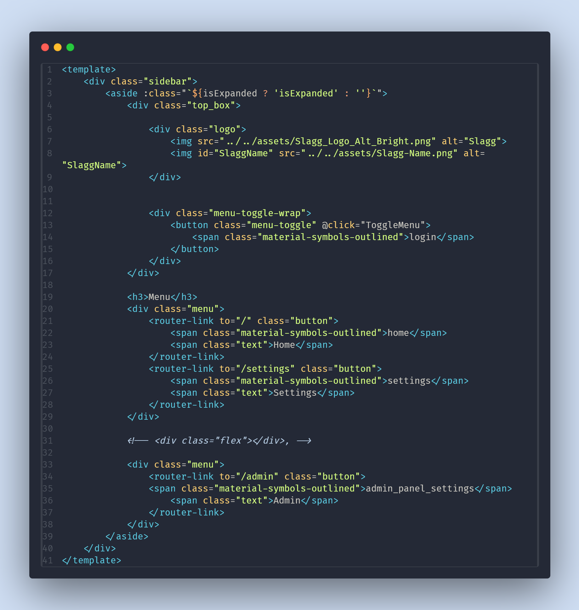
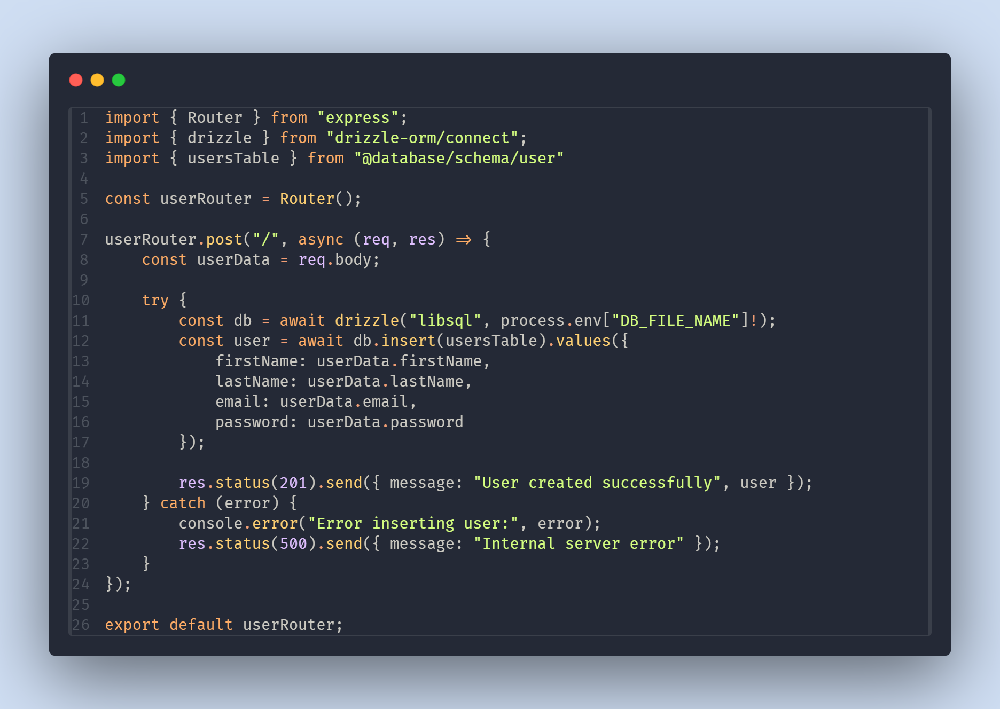
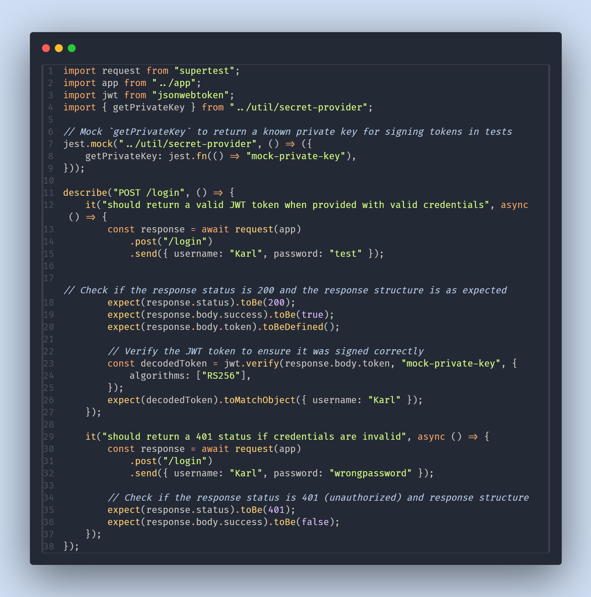

# 5.1 Implementierung der Datenmodelle
Die Datenmodelle werden aus den Schema-Definitionen der Drizzle ORM abgeleitet. Ein Codebeispiel für das User-Modell, das zur Veranschaulichung aller anderen Modelle dient, ist im Anhang unter [hier Verweis einfügen] zu finden.

# 5.2 Implementierung der Datenbank
Die Schema-Definitionen der Drizzle ORM werden in TypeScript beschrieben. Zunächst wird der Datenbanktyp festgelegt, in unserem Fall SQLite, gefolgt vom Tabellennamen und den einzelnen Feldern mit ihren jeweiligen Datentypen. Ein Beispiel für die User-Tabelle ist im Anhang unter [hier Verweis einfügen] zu finden.

# 5.3 Implementierung der Benutzeroberfläche
Die Benutzeroberfläche ist in Vue.js, einem JavaScript-Framework, das auch mit TypeScript genutzt werden kann, entwickelt. In unserem Fall haben wir diese Option gewählt. Zur Veranschaulichung der Nutzung von Vue.js haben wir die Sidebar als Beispiel ausgewählt. Den HTML-Code dazu finden Sie im Anhang unter [hier Verweis einfügen].

# 5.4 Implementierung des Backends
Express.js ist eine JavaScript-Bibliothek, die TypeScript-Support bietet, den wir genutzt haben, um leicht erweiterbare API-Endpunkte zu erstellen. Als Beispiel haben wir einen Endpunkt zur Erstellung von Benutzern implementiert. Der dazugehörige Code ist im Anhang unter [hier Verweis einfügen] zu finden.

# 5.5 Testen der Anwendung
Für Unit-Tests verwenden wir Jest, ein Test-Framework für JavaScript/TypeScript, das es ermöglicht, automatisierte und reproduzierbare Tests deklarativ zu schreiben. Ein Beispiel für einen Test des Login-Endpunkts ist im Anhang unter [hier Verweis einfügen] zu finden.

